# Introduction

Enterprises today are exploring ways to upgrade existing applications to harvest value from **machine learning**. Business have lots of structured and unstructured data already. Machine learning is not a one time activity where you train a model and  it can live forever. There are things such as concept drift that makes the model stale. The stale model has to be minimally periodically retrained with fresh batch of data. To continue to get value out of machine learning models we need an architecture and process in place to repeatedly and consistently train new models and retrain existing models with new data.

In the workshop, we will discuss how you can build an end to end pipeline for machine learning. Machine learning is more than building a cool model. It involves tasks that includes data sourcing, data ingestion, data transformation, pre-processing data for use in training, training a model and hosting the model.

AWS provides several services to address specific needs of different stages of machine learning pipeline. The workshop have multiple labs that focus on different stages of machine learning pipeline. We will be demonstrating the overall flow and design of machine learning pipeline by using movielens dataset to build a recommendation engine for movies. 
Datasource link - https://grouplens.org/datasets/movielens/

The workshop is divided into four labs.  

In Lab 1, we will source the movie-lens dataset from external source on internet, bring it to S3 and upload it into Dynamo DB. In enterprises the equivalent data may be already  present in some RDS, NoSQL or Data-warehouse system. The data can be ingested as a one time full-load as a batch or as a real-time stream of data. 

Lab 2 - Depending on the usecase, there may be a need to do both batch and stream or just a batch or a stream. In the current workshop, we will do a one full-load of data into Dynamo DB and then stream new records into Kinesis stream using the Lamda function as a source simulator. 

Lab 3 - In this Lab, you will use Glue Data Catalog to define schema on the data stored in S3 and DynamoDB. You will perform ETL on the data to prepare it for the machine learning process.

Lab 4 - At this point you should have all you files in an AWS S3 bucket ready for Data Science work. We will use Amazon Sagemaker for model training and inference.

The labs are **sequential** and participants will have to complete them in the sequence. Each lab has references to resources and instruction to help you complete the lab successfully.


## Reference Architecture
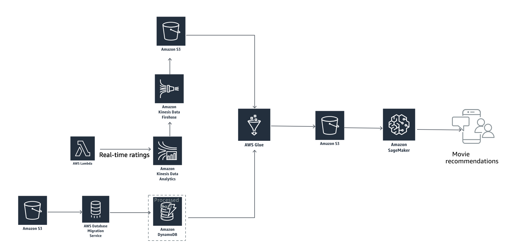

## **Lab 1 - Use DMS to copy data from S3 to DyanamoDB**

### Prerequisites and assumptions

To complete this lab, you need an AWS account that provides access to AWS services.

The resources will be created using cloud formation. The cloud formation templates are agnostic of an AWS region in which they are executed. The only pre-condition is that all the services that are required for end to end solution are available in the region that you choose to work.

The cloud formation can be executed in two modes. 

You can choose to run CloudFormation templates one by one manully in sequence. In total five CloudFormation templates are required to build the full DMS stack to move data from source to target. The sequence number is indicated in the suffix of CloudFormation templates yaml files. Running five CloudFormation templates i.e. <filename>-001.yaml - <filename>-005.yaml will  create the full DMS stack and will also start the DMS replication task. 

The second way to create full DMS stack is to run the dms-full-stack-nested.yaml file that will automatically run the five CloudFormation templates i.e <filename>-001.yaml - <filename>-005.yaml sequentially without manual intervention.

For this workshop we will go with second option. Run one nested CloudFormation template to create full DMS stack. Follow steps outlined below to create full DMS stack. The output of this step will be four dynamo Db tables populated with movie-lens data. You will see 5th table named <exceptions> with now records.

### List of resoucres

We will provision following resources using CloudFormation templates:

1. Amazon S3 bucket to hold movielens data.
2. IAM roles to provide access to Database Migration Service to access and provision other AWS resources
4. VPC, Subnet, Internet Gateway and Security Group to provisio DMS Replication Instances.
5. DMS replication instance and DMS tasks
6. Lambda function to copy movie-lens data from external source into S3 bucket in the account.
7. Lambda function to start DMS task replication.

### Execution steps

1. Sign into AWS console with Valid credentials
2. Choose AWS region. Preferred region for this lab is N Virginia.
3. Navigate to Cloudformation service console. 
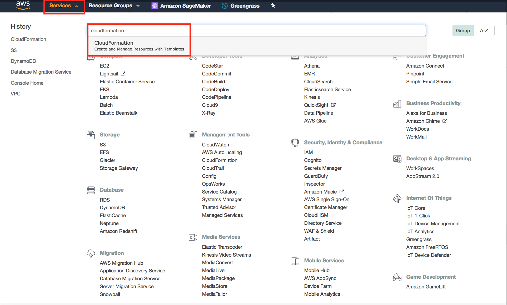 
4. Click 'Create Stack'. 
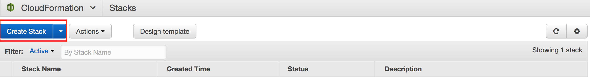 
5. Click the 'Launch Stack' button(either Oregon or N. Virginia) to launch stack and then click 'Next':
   
Launch in the Oregon Region    
<a target="_blank" href="https://console.aws.amazon.com/cloudformation/home?region=us-west-2#/stacks/new?stackName=MLDataLakeLab&templateURL=https://s3-us-west-2.amazonaws.com/prc-reinvent-2018/cfn-scripts/dms-full-stack-nested.yaml"><span></span></a>  
**OR**         
Launch in the N. Virgina Region    
<a target="_blank" href="https://console.aws.amazon.com/cloudformation/home?region=us-east-1#/stacks/new?stackName=MLDataLakeLab&templateURL=https://s3-us-west-2.amazonaws.com/prc-reinvent-2018/cfn-scripts/dms-full-stack-nested.yaml"><span></span></a>         
      
 
6. Specify MLDataLakeLab as StackName and click 'Next'. 
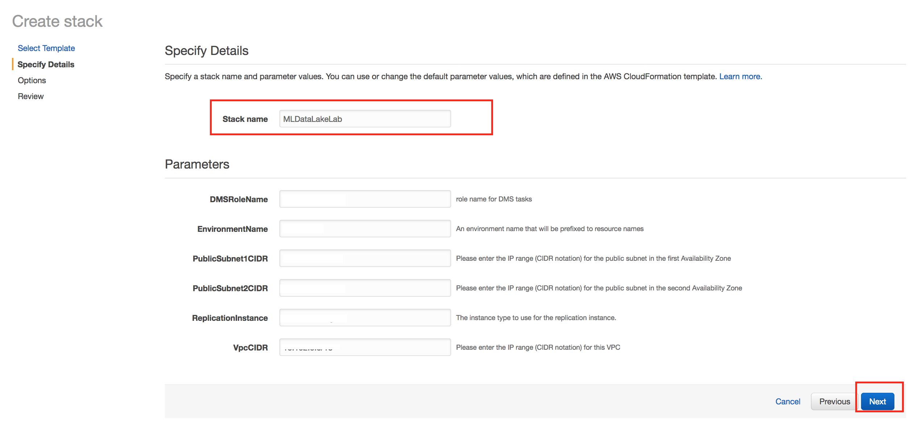
7. Click 'Next'. 
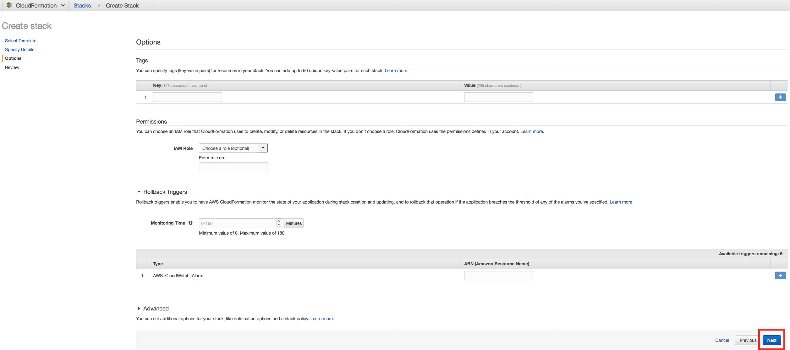
8. Confirm permission to create IAM resources with custom names and click 'Create'. 
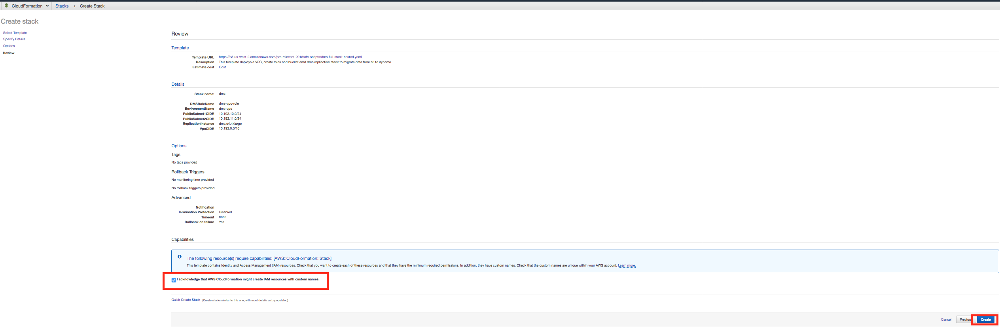
9. Wait for Cloudformation to provision all your resources. It will take around 15 minutes for complete execution.

###Validation steps
1. Validate in CloudFormation console that DMS stack has been created successfully. 
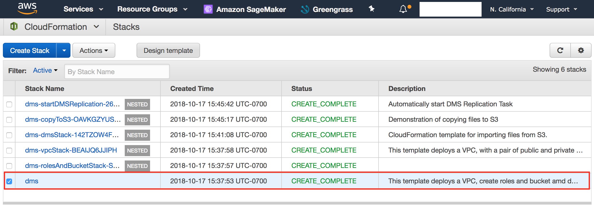 
2. Click Services, search DMS and Click on Database Migration Service 
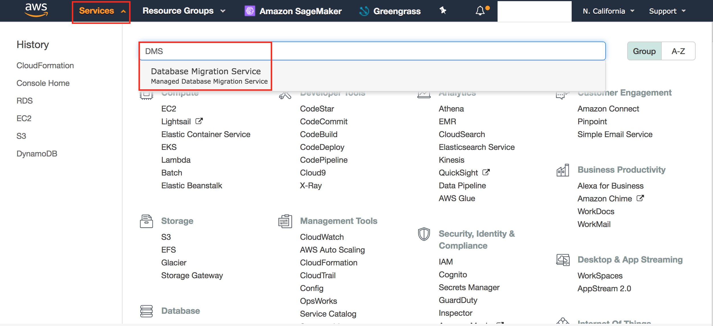 
3. Click 'Tasks'. 
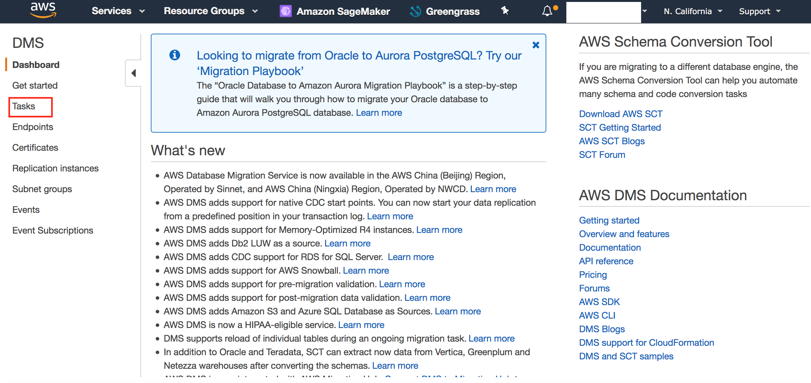 
4. Validate that load is 100% complete and status is 'Load complete'. 
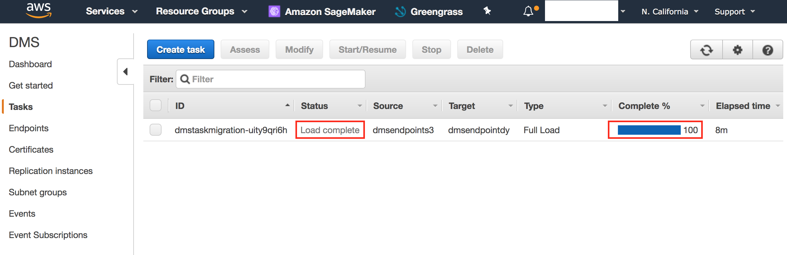 
5. Click Services, search for Dynamo and Click 'DynamoDb'. 
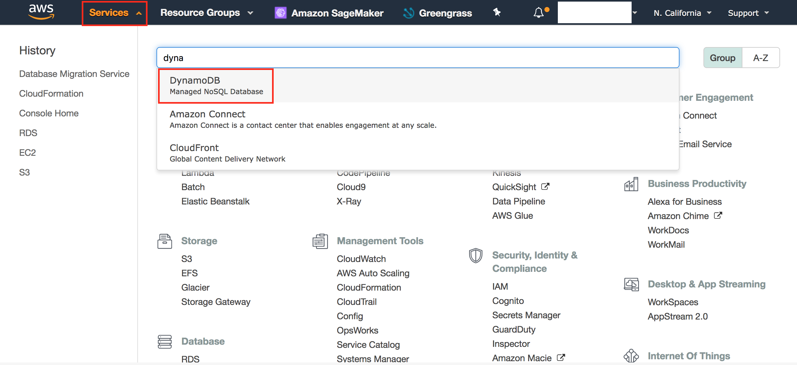
6. Click 'Tables'. 
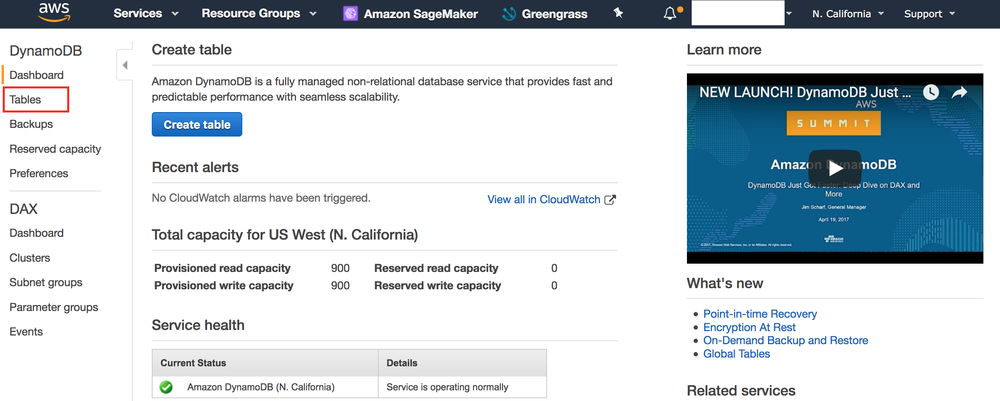
7. Confirm that 5 tables has been created. 
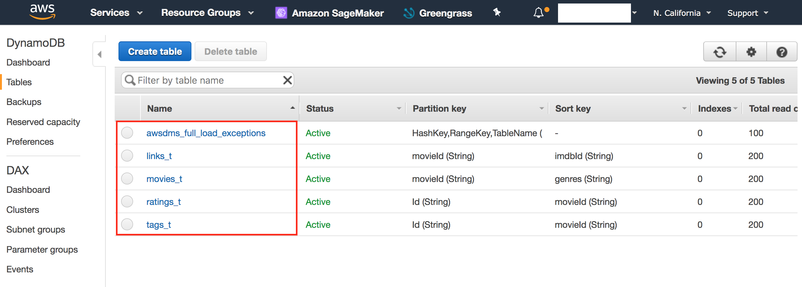
8. Click on awsdms_full_load_exceptions tables has 0 items. 
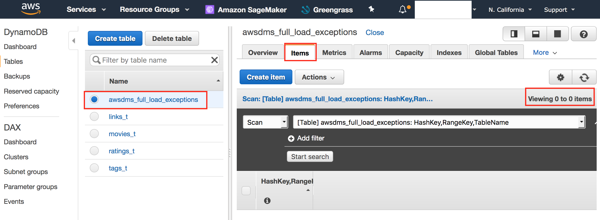
9. Click links_t table and confirm that items are not empty. 
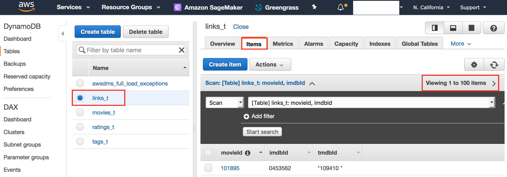
10. Click movies_t table and confirm that items are not empty. 
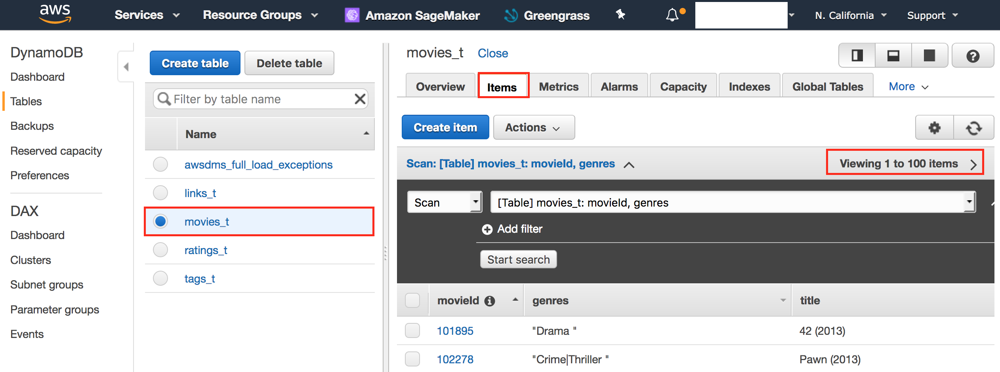
11. Click ratings_t table and confirm that items are not empty. 
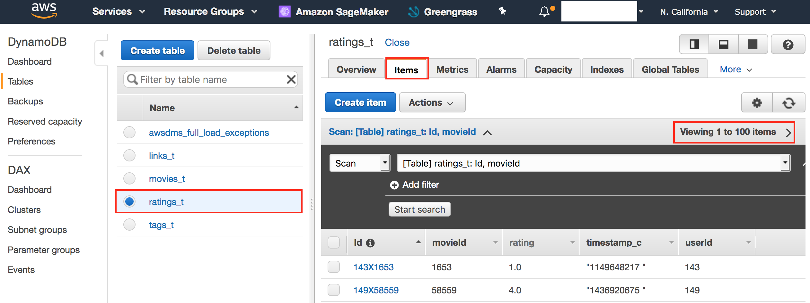
12. Click tags_t table and confirm that items are not empty. 
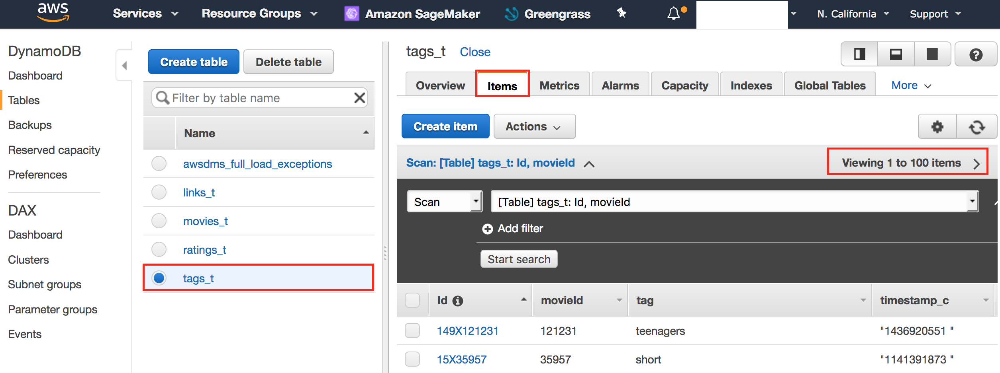

Congrats!! You have successfully completed Lab 1

# **Lab 2 - Stream Data with Kinesis**

In this Lab, we will setup setup a Lambda function to push user rating data into Kinesis data stream and then use Amazon Kinesis Firehose to export data to S3. The Lambda function will simulate user generated real time ratings data. Amazon Kinesis makes it easy to collect, process, and analyze real-time, streaming data so you can get timely insights and react quickly to new information. By using Kinesis, we can store real time data data update our machine learning model. Kinesis supports multiple consumers for its data streams so another consumer can be setup to process data and store it into DynamoDB.


## 1. Create an Amazon Kinesis stream

   1. Sign into the AWS management console.
   2. In the upper right hand of the console make sure you are in the desired region (eg: N Virginia)
   3. Click on kinesis from the list of services. You will arrive on the kinesis dashboard.
   4. On the Kinesis Dashboard, click **Data Stream** on the left panel and then click **Create** **Kinesis Stream**. If you do not see the panel but a welcome page, go ahead and click “**Get Started**”.
    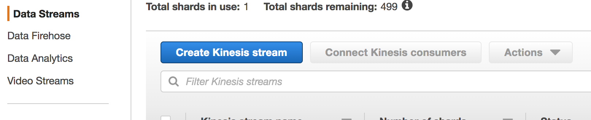
   5. For Kinesis stream name, enter YourInitials_stream. Enter 1 for Number of Shards. Click on create Kinesis stream. The stream will be on creating status. Wait for stream to be in **ACTIVE** status.
    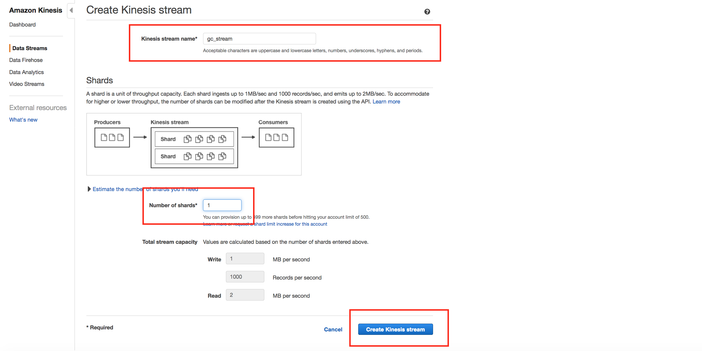


## 2. Create an Amazon Kinesis Firehose stream

   1. Sign into the AWS management console.
   2. In the upper right hand of the console make sure you are in the desired region (eg: N Virginia)
   3. Click on kinesis from the list of services. You will arrive on the kinesis dashboard.
   4. On the Kinesis Dashboard, click **Data Firehose** on the left panel and then click **Create** **Delivery Stream**. If you do not see the panel but a welcome page, go ahead and click “**Get Started**”.
     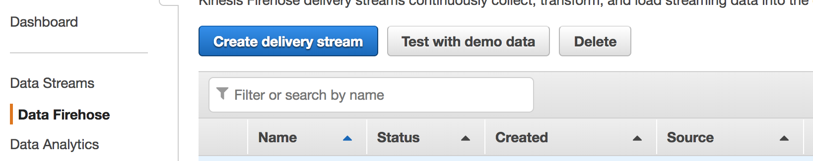
     
   5.	For Delivery stream name, enter YourInitials_firehosestream. In the Source option field, choose Kinesis stream and in the Kinesis stream drop down, select the stream created in previous section. Click Next
     
     
   6. In the Process records page, choose Disabled. Note that Amazon Kinesis Firehose provides the capability through Lambda to transform the source data before loading them into the destination datasource. 
    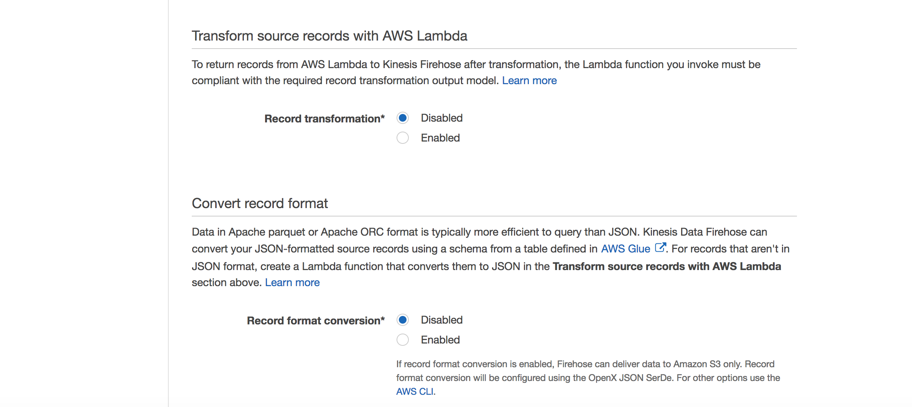
   7. Click Next.
   8. Choose Amazon S3 as the Destination. For S3 bucket, choose the bucket that was created for you Lab 1. The bucket name should be a number (aws account #) ending with reinvent-2018-data. Specify **firehose** as the prefix and click next.
    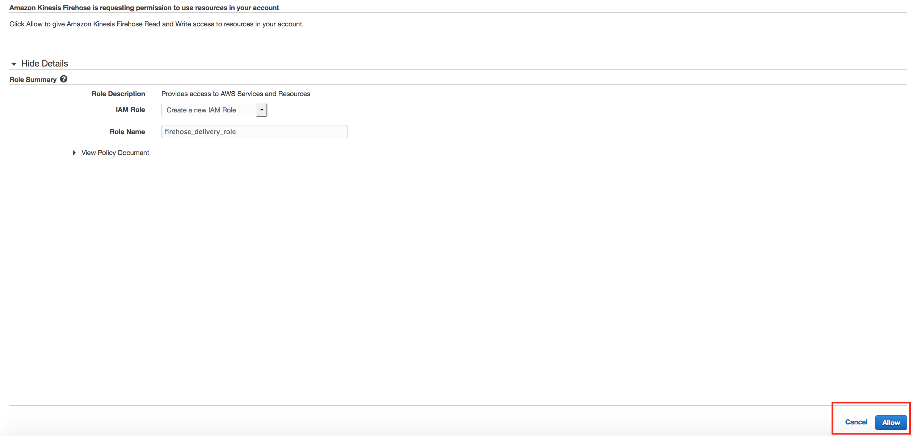
   9. On **Configure Settings** select to create a new IAM and click on **Allow**. Click Next and choose **Create delivery stream**
    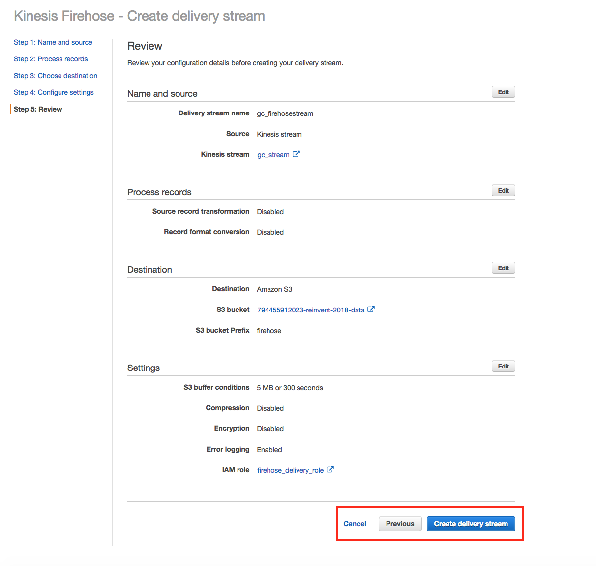

##  3. Create AWS Lambda function to load data into stream

1. Sign into the AWS management console.
2. In the upper-right corner of the AWS Management Console, confirm you are in the desired AWS region (e.g., N. Virginia).
3. Click on Lambda from the list of all services. This will bring you to the AWS Lambda dashboard page.
4. On the Lambda Dashboard, click Create Function
  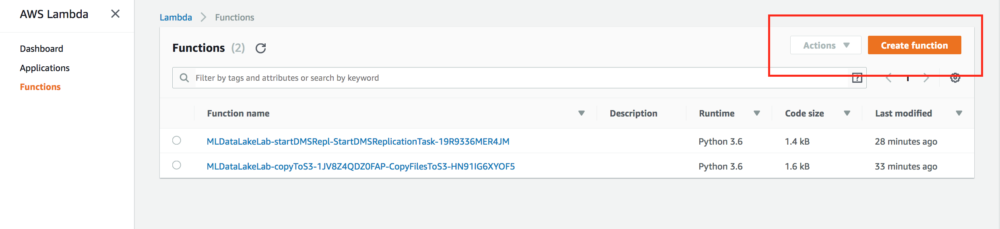
5. Select Author from scratch and enter the following

```
  Name: YourInitials_simulator
  Runtime: Python 3.6
  Role: Choose an existing role
  Exiting Role: lambda-kinesis-role
```
  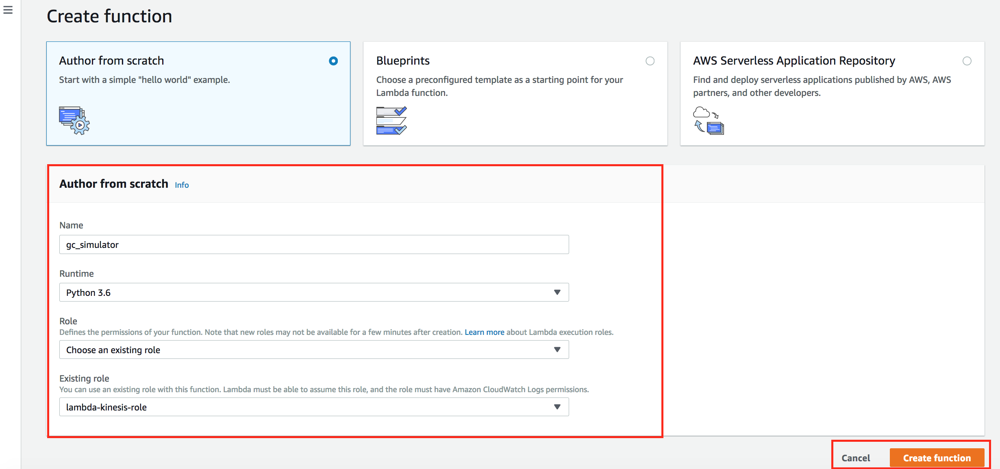
			
6. Click Create function
7.	In code editor, copy and paste the code under lambda folder of this project.
8. For variable bigdataStreamName, choose the name of the stream created in Section 1.

 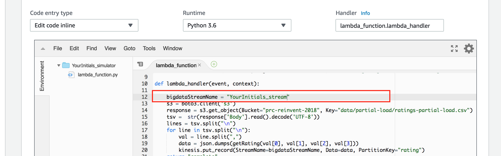

9. Leave everything default except the Timeout value in the Basic Setting section near the bottom of the page. Change it from 3 seconds to 8 minutes
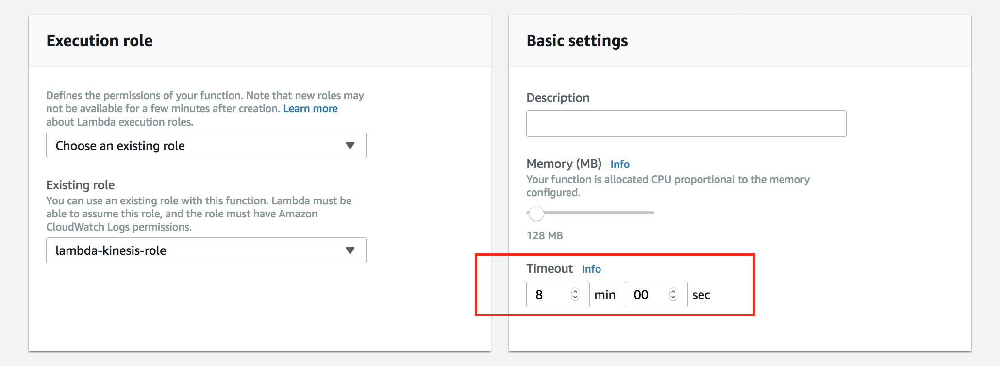

10. Click Save on the top right hand corner of the screen and then click Test. Since we are not providing any parameter or input values, leave everything default, give it a name **Test**, and click Create. 

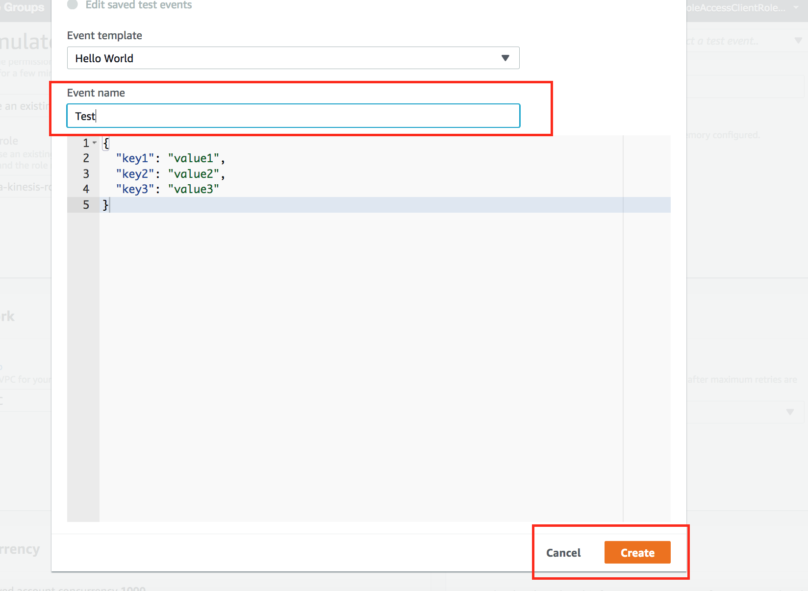

11. The function will run 8 minutes to put rating data into the Kinesis stream. Note you may get a timeout error, this is normal as the function timed out (8 mins) before it could push all records. Continue to next step.
12. So far, we have a Kinesis stream and we have created the Lambda function to put ratings records into the stream. We also setup Kinesis Firehose to retrieve the data in the stream and store them in a S3 bucket. To verify everything is working, go to the S3 bucket and verify the data files exist. Note Kinesis Firehose stores data in a year/month/date folder.

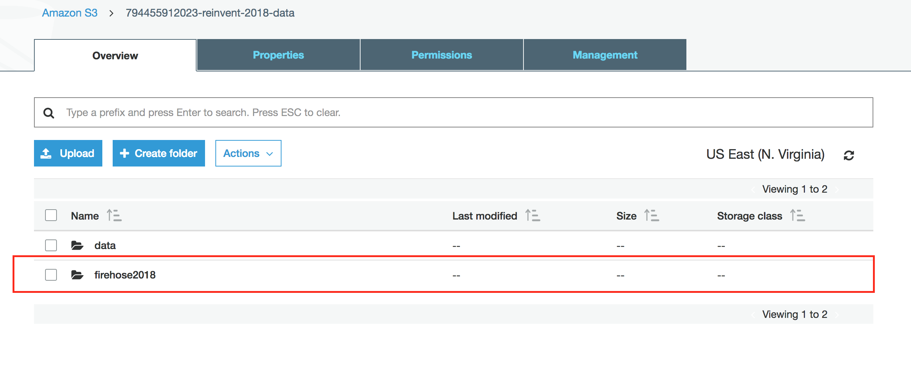


# **Lab 3 - Create an AWS Glue Job**

In Lab 2, you used Kinesis to collect and store real time ratings data into S3. In this Lab, you will use Glue Data Catalog to define schema on the data stored in S3 and DynamoDB. You will perform ETL on the data to prepare it for the machine learning process. The output data from Glue will be used at input to the Amazon Sagemaker notebook.

## 1. Populate the S3 Glue data catalog

1. The AWS Glue Data Catalog is an index to the location, schema, and runtime metrics of your data. It contains references to data that is used as sources and targets of your extract, transform, and load (ETL) jobs in AWS Glue. The Data Catalog is a drop-in replacement for the Apache Hive Meta-store and provides a uniform repository where disparate systems can store and find metadata to keep track of data, and use that metadata to query and transform the data. To populate the data catalog, we need to first create a role with proper permissions and then a crawler to take inventory of the data in our S3 bucket and Dynadb tables.

2.	Sign into the AWS Management Console https://console.aws.amazon.com/.
3.	In the upper-right corner of the AWS Management Console, confirm you are in the desired AWS region (e.g., N. Virginia).

4.	Click on Glue from the list of all services. This will bring you to the AWS Glue dashboard page.
5.	Click on Crawlers on the left panel and then click Add crawler 
6.	For Crawler name, enter youinnitials_s3_stream.
7.	Click Next 
8.	For Data store, ensure S3 is selected. Browse to firehose2018 prefix in the bucket that was created for you. Click Select and

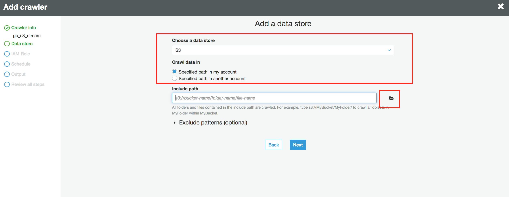
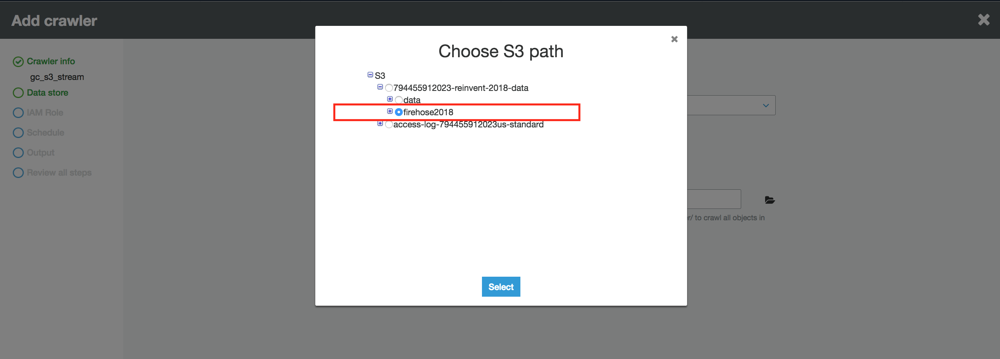

9.	Click Next 
10.	Choose No to Add another data store
11.	Click Next
12.	Choose an existing IAM role and select glue-service-role in the drop down box
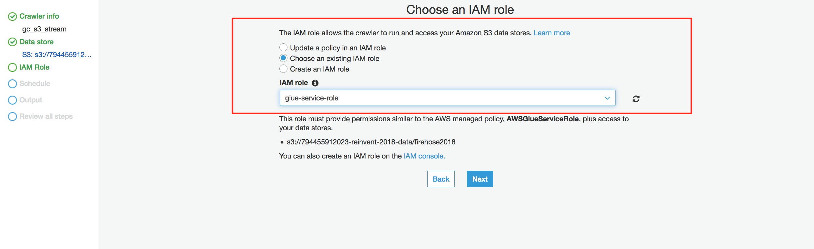

13.	Click Next
14.	For Frequency, choose Run on demand and click Next
15.	For Database, click Add database, name it **ml-data-lake**, and click Create. 

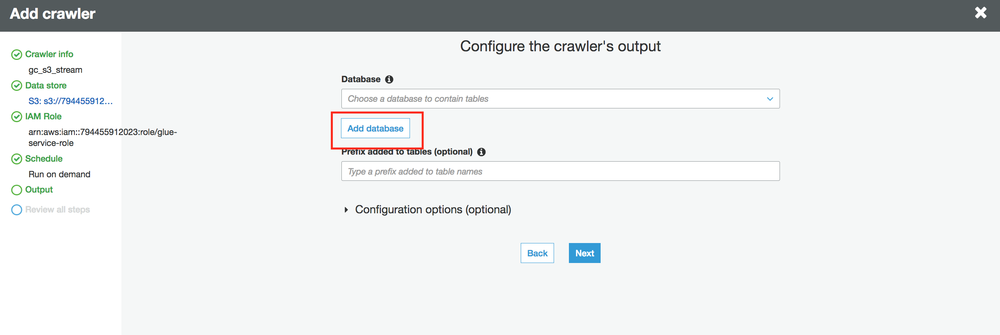
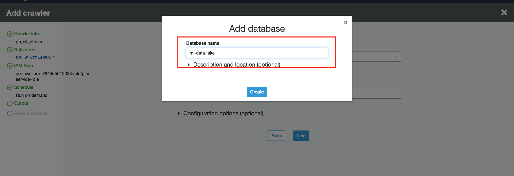

16.	Click Next
17.	Review the configuration and click Finish.

18.	On the Crawlers page, tick the checkbox of the crawler just created and click Run crawler.

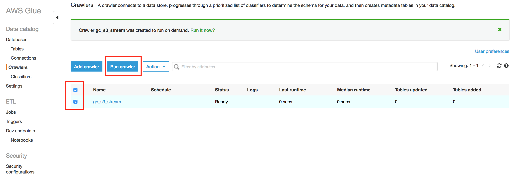

19.	Wait for the crawler to finish.
20.	Click Databases on the left panel and tick the checkbox next to YourInitials_bigdata database, then click View tables. 
21. Verify that your table is created from S3 data.

## 2. Populate the DynamoDB Glue data catalog

1.	Go back to AWS Management Console https://console.aws.amazon.com/.

2.	In the upper-right corner of the AWS Management Console, confirm you are in the desired AWS region (e.g., N. Virginia).
3.	Click on Glue from the list of all services. This will bring you to the AWS Glue dashboard page.
4.	Click on Crawlers on the left panel and then click Add crawler 
5.	For Crawler name, enter gc_dynamodb_stream.
7.	Click Next 
8.	For Data store, ensure DynamoDB is selected. Choose movies_t table and click next.

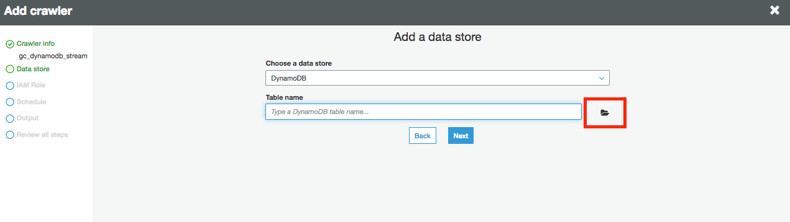
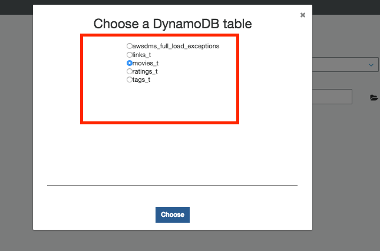

9.	Click Next 
10. Choose Yes to Add another data store
11. For Data store, ensure DynamoDB is selected. Choose links_t table and click next.
12.	Choose Yes to Add another data store
13. For Data store, ensure DynamoDB is selected. Choose ratings_t table and click next. You have now selected the 3 DynamoDB tables created in Lab1.
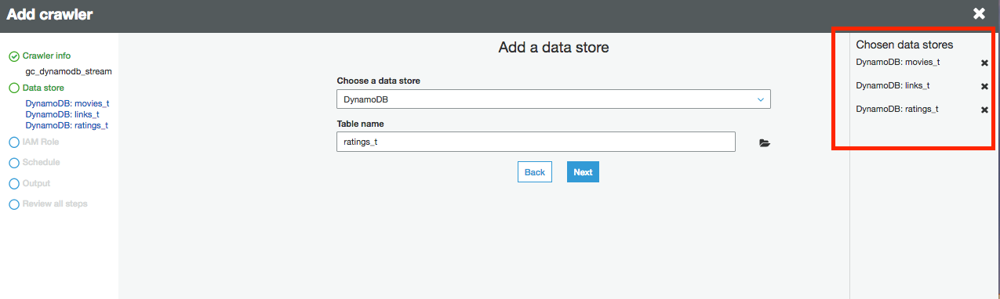

14.	Click Next
15. Choose No to Add another data store
16.	Choose an existing IAM role and select glue-service-role in the drop down box.

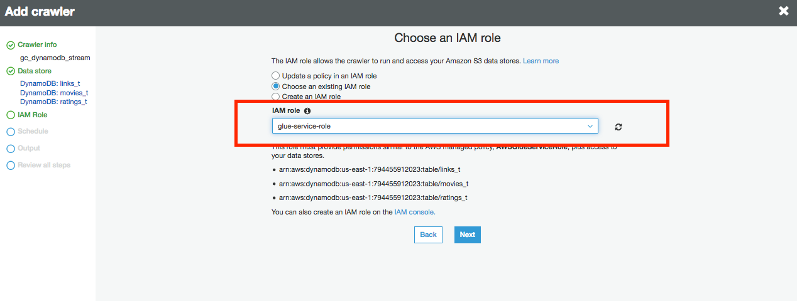

17.	Click Next
18.	For Frequency, choose Run on demand and click Next
19.	For Database, click choose existing database created in above session ml-data-lake, and click Create. 


20.	Click Next
21.	Review the configuration and click Finish.
22.	On the Crawlers page, tick the checkbox of the crawler just created and click Run crawler.
22.	Wait for the crawler to finish.
23.	Click Databases on the left panel and tick the checkbox next to ml-data-lake database, then click View tables. 
24. Verify that 3 tables are created which store information about data in DynamoDB.


## 3. Transform data from Glue

1.	Sign into the AWS Management Console https://console.aws.amazon.com/.

2.	In the upper-right corner of the AWS Management Console, confirm you are in the desired AWS region (e.g., N. Virginia).
3.	Click on Glue from the list of all services. This will bring you to the AWS Glue dashboard page.
4.	Click on Jobs on the left panel.
5. Click Add job.
6.	In Job properties page, enter the following

```
			Name: yourinnitials_ml_datalake
			IAM role: glue-service-role
			The job runs: A new script to be authored by you
			Expand Script libraries and job parameters section and change Concurrent DPUs per job run from 10 to 50. This will help speed up the transformation process.
			Leave everything else default
```
 
 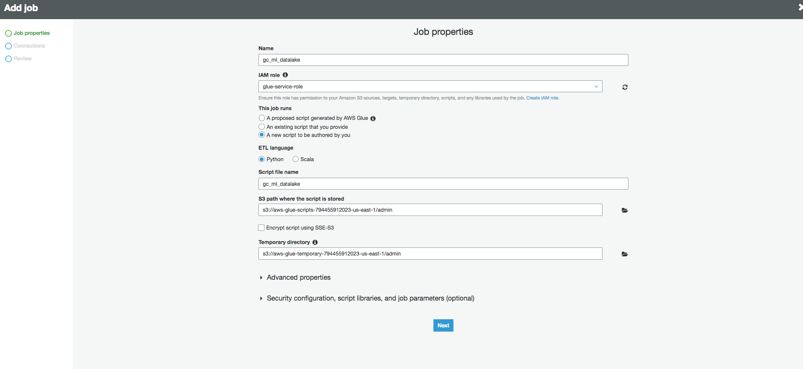
 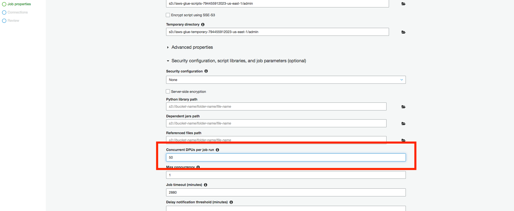
 
9.	Click Next
10.	Skip output table selection and click Next. Click on Save Job and Edit Script.

 
 
11. In the script page copy the script under folder glue of this project and paste it in the editor. Change the variable s3_bucket to the S3 bucket created for you.

 
 
12. Click on RunJob and move to setup of the next Lab. This Job can take about 10-15 mins to complete when Glue launches the cluster for the first time.
13. Once the Job is complete verify that Glue has 3 output directories for your machine learning job. 


# **Lab 4 - Amazon Sagemaker**

At this point you should have all you files in an AWS S3 bucket ready for Data Science work. 
The following steps will walk you through all the processes required for this part of the lab.

## Step 1: Launch an Amazon SageMaker Notebook Instance

1. Open the AWS management console, ***search*** and ***select SageMaker***.


2. From the SageMaker dashboard, click ***create notebook instance***


3. On the create notebook instance page, do the following:
	1. Give your notebook instance a name your will remember.
	2. Select ml.m4.16xlarge for notebook instance type.
	3. For your IAM role - select **create a new role** from the drop down menu.
 

4. Select ***any S3 bucket*** from the pop-up dialogue box and ***create role***


5.	Amazon SageMaker will create a new role for you and pre-select that role. Next ***create notebook instance***.


6.	If you are here, your instance is launching; thus in ***pending*** status. You should be able to access your notebook in less than 5 mins. 


## Step 2: Accessing your notebook instance
1.	To access your notebook, kindly wait until your instance status is ***InService*** and click ***open***.


2. Your notebook landing page should be similar this below:


3. Open a terminal by clicking on **New** and then **Terminal**


4. Run the following commands in your terminal (**copy, paste and press enter**) and ensure to follow the instructions on your terminal screen.
```
wget https://s3.amazonaws.com/dallas-ai-day/SageMaker-Reco/Helper.sh
sh Helper.sh
```

5. After running both commands above, your output should be similar to this:


6. Return to your notebook landing page by selecting your browser tab titled **Home**. Click on the **Movie _Recommender _Lab4.ipynb** notebook and proceed with the instructions in the notebook.  


7. **Congratulations!** you have finished all the labs. Please make sure to delete all resources as mentioned in the section below.

## Cleanup Resources
1. Navigate to DynamoDb Console 
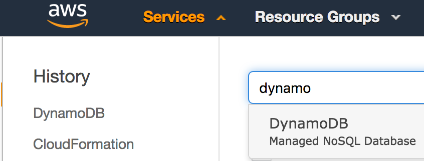 
2. Delete all tables created in Lab 1 one-by-one. 
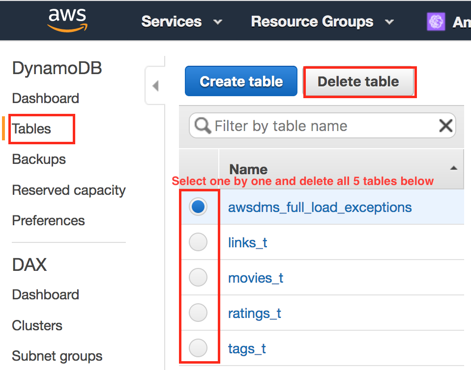 
3. Navigate to S3 Console. 
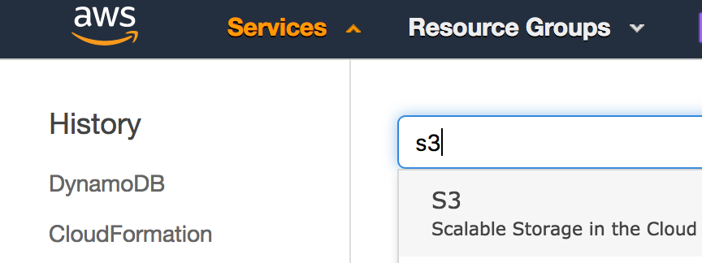 
4. Find Bucket created in Lab 1 and Click to list objects in the bucket.
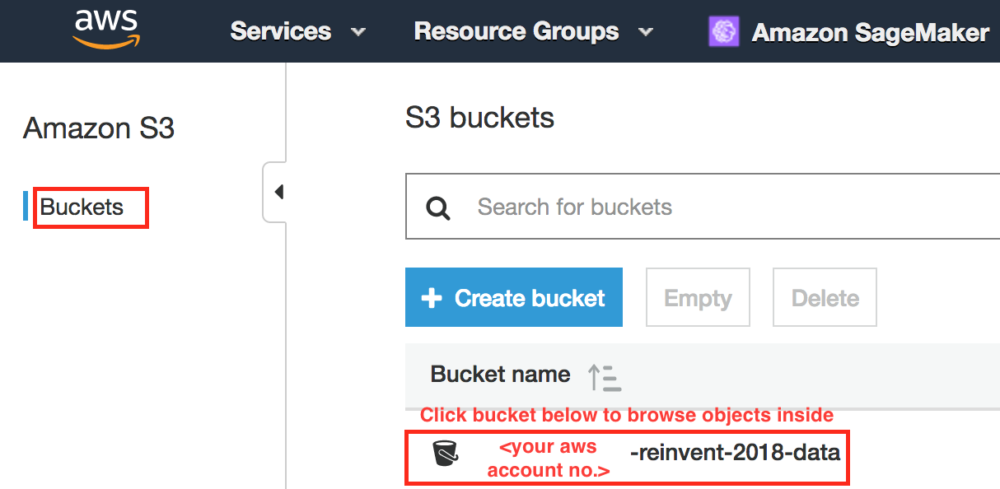 
5. Delete all object listed in bucket one-by-one.
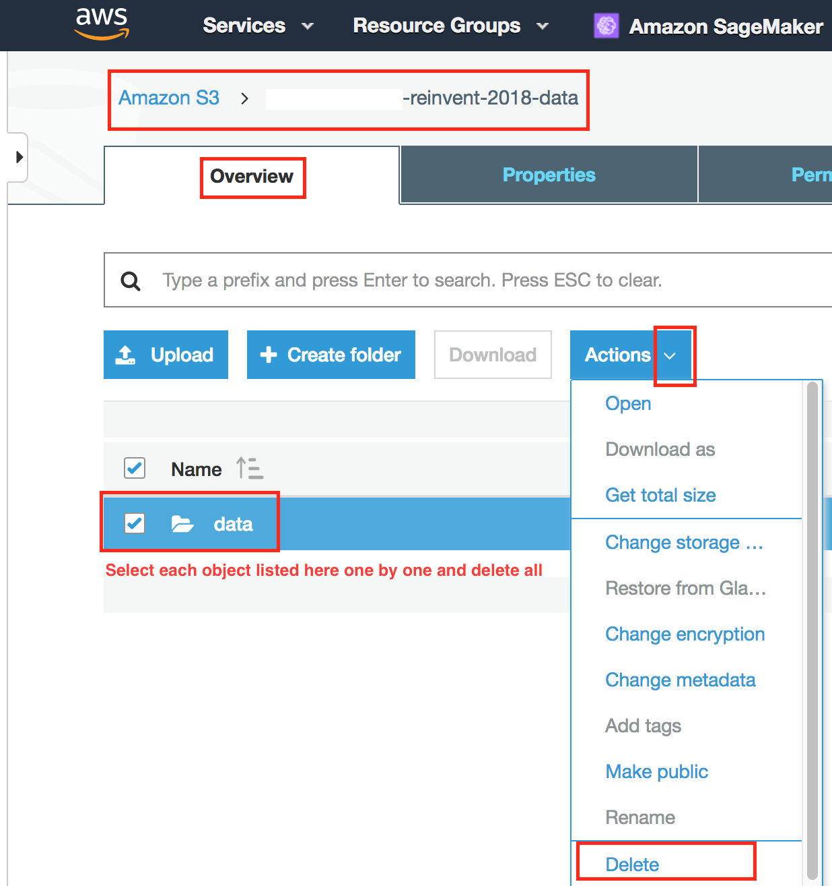 
6. Navigate to CloudFormation Console. 
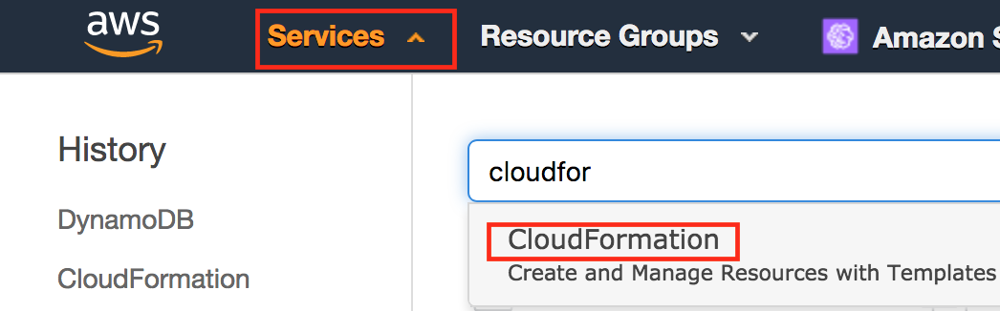 
7. Check the 'dms'stack created in Lab 1 and perform delete operation.
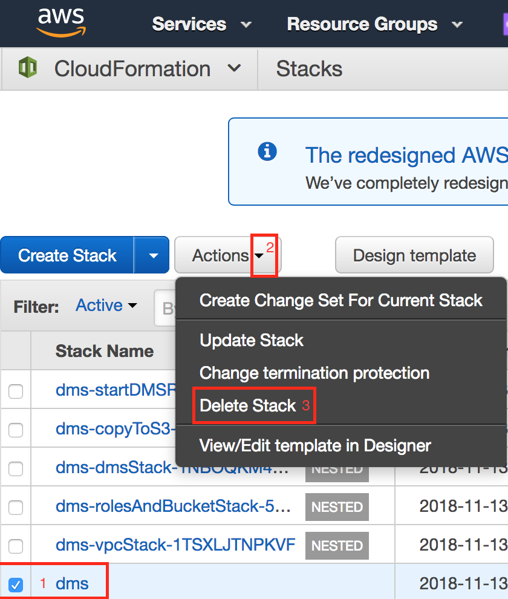
8. Delete Kinesis Data Stream and Firehose stream.
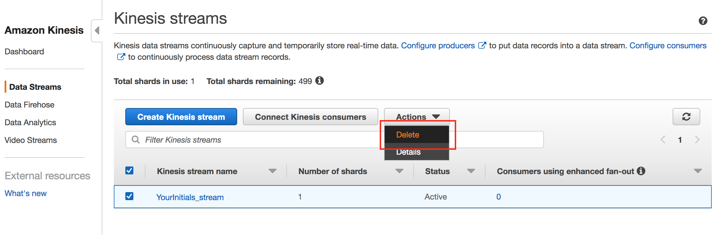
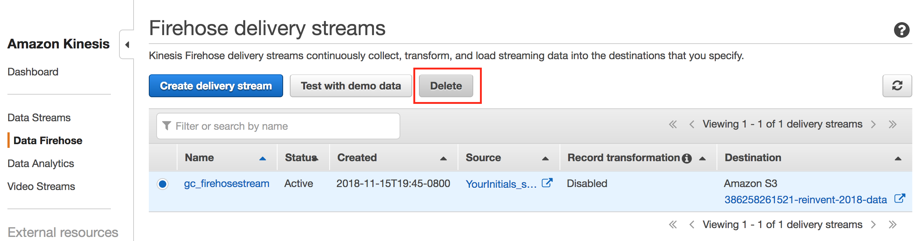
9. Delete AWS Lambda function.  
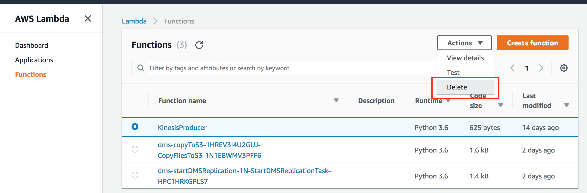
10. Delete AWS Glue crawler and job. 
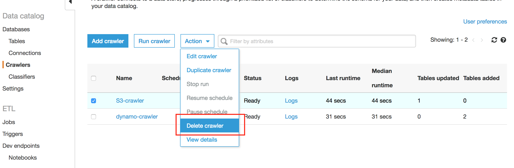
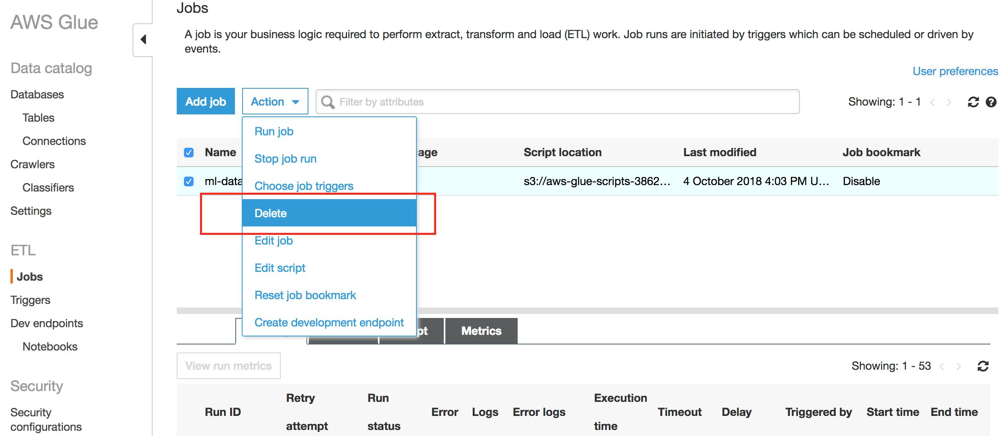
11. Go to Amason Sagemaker console to shutdown your notebook instance, select your instance from the list.

12. Select **Stop** from the **Actions** drop down menu. 

13. After your notebook instance completely **Stopped**, select **Delete** fron the **Actions** drop down menu to delete your notebook instance.

 


    

